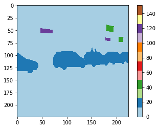
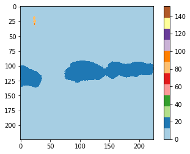
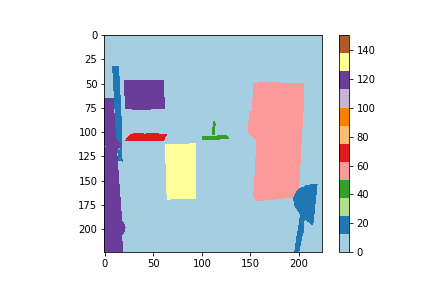
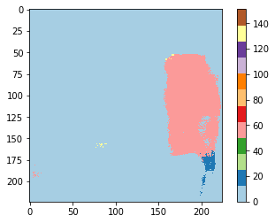
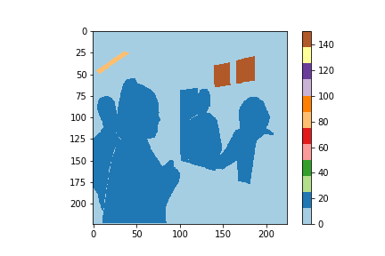
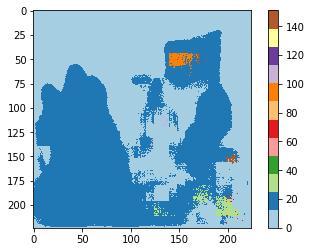

# FCN을 이용한 Semantic Image Segmentation 구현 – FCN.tensorflow

FCN 구조를 이용해서 Semantic Image Segmentation을 구현해봅시다.

## 실행법(Howo to run)

먼저 학습을 위해서 FCN.py 스크립트를 실행합니다.
```
python FCN.py
```

학습이 끝나면 visualize 모드로 이미지에 대한 Semantic Image Segmentation 결과를 시각화합니다.
```
python FCN.py --mode=visualize
```

## Visualization 결과를 컬러로 확인하기
터미널에서 아래 명령어로 jupyter notebook을 켜고 result_color_visualization.ipynb 스크립트를 실행하면, Visualization 결과를 컬러로 확인할 수 있습니다.

```
jupyter notebook
```

   

   

   

## Reference
[https://github.com/shekkizh/FCN.tensorflow](https://github.com/shekkizh/FCN.tensorflow)
