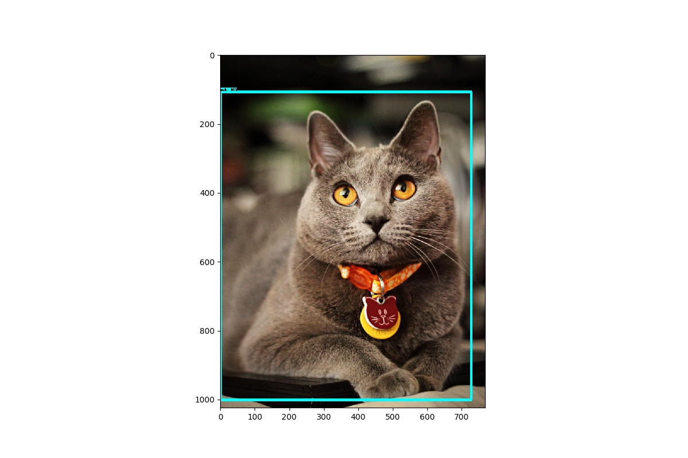

# 사전 학습된 Faster R-CNN 모델로 Object Detection 수행
사전 학습된 Faster R-CNN 모델로 Object Detection을 수행하기 위해서는 아래 과정을 단계별로 수행해야 합니다.

## protoc 설치 및 컴파일
아래 홈페이지를 참조해서 프로토콜 버퍼 컴파일러인 protoc을 설치합니다.

[https://developers.google.com/protocol-buffers/](https://developers.google.com/protocol-buffers/)


protoc를 설치했다면 deep-learning-book-code/Ch13-Fine-Tuning/faster_rcnn_object_detection/ 경로에서 아래 명령어로 프로토콜 버퍼 라이브러리를 컴파일합니다.

```
protoc object_detection/protos/*.proto --python_out=.
```

# faster_rcnn_inference.py 실행
프로토콜 버퍼 라이브러리를 컴파일했다면 faster_rcnn_inference.py 스크립트를 이용해서 이미지에 대한 Object Detection을 수행할 수 있습니다.

```
python faster_rcnn_inference.py
```

Object Detection 수행 결과:




## Reference
[https://github.com/tensorflow/models/tree/master/research/object_detection](https://github.com/tensorflow/models/tree/master/research/object_detection)
